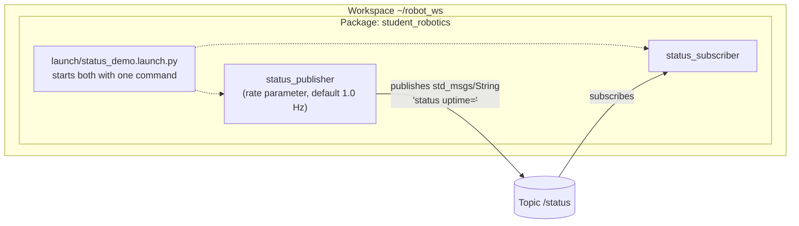

# ROS 2 Architecture — Workspace, Package, Node, Topic

## Layered View

```text
+----------------------------------------------------------+
|  Workspace  ~/robot_ws            (overlay)              |
|    src/          your packages' source                   |
|    build/        colcon intermediate files               |
|    install/      built packages + setup.bash             |
+----------------------------------------------------------+
|  /opt/ros/humble                  (underlay)             |
|    desktop install: core libraries, demo packages, RViz  |
+----------------------------------------------------------+
```

A workspace is a directory where you build your own packages on top of
an underlay (the base ROS 2 installation). Sourcing
`install/setup.bash` puts the overlay in front of the underlay.

## Package → Node → Topic



- **Workspace** — one build/unit of development (`~/robot_ws`), built
  with colcon.
- **Package** — the unit of organization and release inside a workspace;
  contains nodes, message definitions, launch files (`ament_python` or
  `ament_cmake`).
- **Node** — one process with one purpose (e.g. read a sensor, drive a
  motor). Our package has a publisher and a subscriber.
- **Topic** — a named channel nodes use to exchange messages
  anonymously: the publisher does not know who listens.
- **Message** — the typed data on a topic (e.g. `std_msgs/String`).
- **Parameter** — a per-node configuration value set at startup
  (`rate` controls the publisher's timer period).
- **Launch file** — a Python script that starts several nodes as one
  unit and can pass parameters to them.
- **Service / Action** — request/response and long-running goal
  patterns, complementing the continuous topic stream.

## Our System in These Terms

`status_publisher` declares a `rate` parameter (default 1.0 Hz), creates
a timer with period `1/rate`, and publishes a `std_msgs/String` on
`/status` on every tick — the message carries a sequence number and the
node's uptime. `status_subscriber` subscribes to `/status` and logs each
message. They discover each other at runtime through DDS — no central
broker, no manual wiring.

Two ways to start the system:

```bash
# one node per terminal
ros2 run student_robotics status_publisher
ros2 run student_robotics status_subscriber

# both nodes from one command, with a custom rate
ros2 launch student_robotics status_demo.launch.py rate:=2.0
```

`ros2 topic hz /status` measures the actual publish rate — with
`rate:=2.0` it reports ~2.0 Hz (verified in
[ros2_communication_tests.md](ros2_communication_tests.md)).

The same two concepts first appeared in the official demo
(`demo_nodes_cpp` talker/listener on `/chatter`); our package replaces
the demo with code we own, version-controlled, and rebuildable from a
clean clone.
