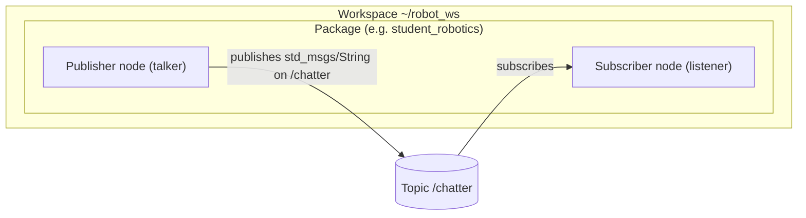

# ROS 2 Architecture — Workspace, Package, Node, Topic

## Layered View

```text
+----------------------------------------------------------+
|  Workspace  ~/robot_ws            (overlay)              |
|    src/          your packages' source                   |
|    build/        colcon intermediate files               |
|    install/      built packages + setup.bash             |
+----------------------------------------------------------+
|  /opt/ros/humble                  (underlay)             |
|    desktop install: core libraries, demo packages, RViz  |
+----------------------------------------------------------+
```

A workspace is a directory where you build your own packages on top of
an underlay (the base ROS 2 installation). Sourcing
`install/setup.bash` puts the overlay in front of the underlay.

## Package → Node → Topic



- **Workspace** — one build/unit of development (`~/robot_ws`), built
  with colcon.
- **Package** — the unit of organization and release inside a workspace;
  contains nodes, message definitions, launch files (`ament_python` or
  `ament_cmake`).
- **Node** — one process with one purpose (e.g. read a sensor, drive a
  motor). The official demo has a talker node and a listener node.
- **Topic** — a named channel nodes use to exchange messages
  anonymously: the publisher does not know who listens.
- **Message** — the typed data on a topic (e.g. `std_msgs/String`).
- **Service / Action** — request/response and long-running goal
  patterns, complementing the continuous topic stream.

## The Talker/Listener Demo in These Terms

`ros2 run demo_nodes_cpp talker` starts a node that publishes a
`std_msgs/String` on `/chatter` every second. `ros2 run
demo_nodes_cpp listener` starts a node that subscribes to `/chatter`
and logs each message it receives. They discover each other at runtime
through DDS — no central broker, no manual wiring.
